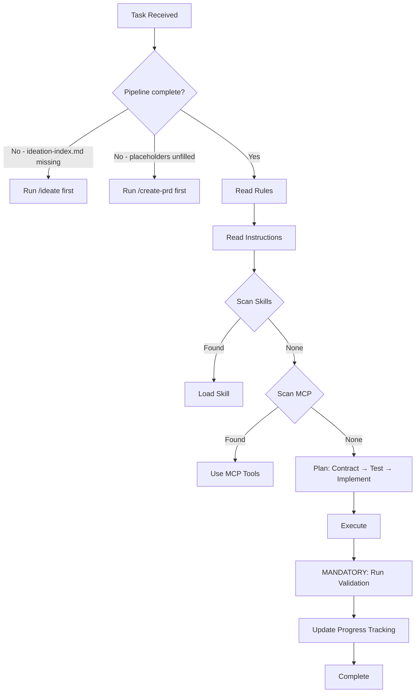

# CFSA Antigravity — Constraint-First Specification Architecture

This is a **Constraint-First Specification Architecture (CFSA)** pipeline. It turns a raw idea into exhaustively specified, test-driven, production-quality code through a series of progressive gates. Stack-agnostic. Agent-agnostic. Cross-platform. Every line of code, every spec, every test is production-grade from the moment it's written. Phases control scope, never quality. There is no "fix it later."

### Entry Point

Start the pipeline with:

```
/ideate                              # From scratch — deep interview
/ideate @path/to/your-idea.md        # From existing document
```

The `@file` pattern is natively supported by `/ideate` (with full multi-mode input classification) and as a simple document-read input by `/evolve-feature`, `/resolve-ambiguity`, and `/propagate-decision`. Other pipeline commands accept direct invocation; `@file` can be passed to them but no automatic input classification is applied — the workflow reads the file and treats it as inline context.

### Progressive Decision Lock

Decisions in this pipeline are **progressively locked**. Each pipeline stage builds on the locked decisions of previous stages:

1. `/ideate` locks the **vision** — problem, personas, features, constraints
2. `/create-prd` locks the **architecture** — tech stack, system design, security model
3. `/decompose-architecture` locks the **domain boundaries** — shard structure, dependencies
4. `/write-architecture-spec` locks the **interaction specs** — per-shard contracts, data models
5. `/write-be-spec` locks the **backend contracts** — API endpoints, schemas, middleware
6. `/write-fe-spec` locks the **frontend specs** — components, state, interactions
7. `/plan-phase` locks the **implementation order** — dependency-ordered TDD slices
7.5. `/setup-workspace` locks the **operational foundation** — project scaffolded, CI/CD green, staging live, database connectable
8. `/verify-infrastructure` locks the **infrastructure verification** — all operational gates green
9. `/implement-slice` locks the **code** — tests → implementation → validation

Once a stage is locked, downstream stages may not contradict it. To change a locked decision, re-run the originating stage and cascade changes downstream.

<!-- Pipeline table maintained by: (1) bootstrap-agents-fill.md Step 4 for project-config sections, (2) kit maintainer checklist for workflow rows — see docs/kit-architecture.md Kit Maintenance Checklist -->
### Pipeline Workflow Table

| # | Command | Input | Output | Stage |
|---|---------|-------|--------|-------|
| 1 | `/ideate` | Raw idea or `@file` | `.memory/wiki/specs/ideation/` folder + `.memory/wiki/specs/vision.md` (summary) | Discovery |
| ↳ | `/ideate-extract` | User input | Classified input + `.memory/wiki/specs/ideation/` folder + loaded skills | Discovery |
| ↳ | `/ideate-discover` | Classified input | Domain files + cross-cut ledger (recursive breadth-before-depth) | Discovery |
| ↳ | `/ideate-validate` | Domains + features | `.memory/wiki/specs/vision.md` (human summary compiled from ideation folder) | Discovery |
| 2 | `/create-prd` | `ideation-index.md` | `architecture-design.md` + `ENGINEERING-STANDARDS.md` + `data-placement-strategy.md` | Design |

> **Persistent intermediary**: `.memory/wiki/specs/ideation/` folder — kept permanently as the pipeline's source of truth for the ideation phase.

| ↳ | `/create-prd-stack` | `ideation/meta/constraints.md` | Tech stack decisions | Design |
| ↳ | `/create-prd-design-system` | Tech stack + brand-guidelines | `.memory/wiki/specs/design-system.md` | Design |
| ↳ | `/create-prd-architecture` | Tech stack | System architecture + data strategy | Design |
| ↳ | `/create-prd-security` | Architecture | Security model + integrations | Design |
| ↳ | `/create-prd-compile` | All prior steps | `architecture-design.md` + `ENGINEERING-STANDARDS.md` | Design |

> **Progressive working artifact**: `.memory/wiki/specs/architecture-draft.md` — written incrementally by shards 1–3, read by shard 4 to compile the final `architecture-design.md`.

| 3 | `/decompose-architecture` | `architecture-design.md` | IA shards + layer indexes | Design |
| ↳ | `/decompose-architecture-structure` | Approved domains | Directory structure + shard skeletons + indexes | Design |
| ↳ | `/decompose-architecture-validate` | Skeletons | Deep dives + type annotations + validation | Design |
| 4 | `/write-architecture-spec` | Skeleton IA shard | Full interaction spec | Specification |
| ↳ | `/write-architecture-spec-design` | Skeleton shard | Interactions + contracts + data models + access control | Specification |
| ↳ | `/write-architecture-spec-deepen` | Drafted sections | Deepening passes + final spec + ambiguity gate | Specification |
| 5 | `/write-be-spec` | IA shard | Backend specification | Specification |
| ↳ | `/write-be-spec-classify` | IA shard | Classification + source material inventory | Specification |
| ↳ | `/write-be-spec-write` | Classified shard | BE spec + indexes + ambiguity gate | Specification |
| 6 | `/write-fe-spec` | BE spec + IA shard | Frontend specification | Specification |
| ↳ | `/write-fe-spec-classify` | BE spec + IA shard | Classification + source material inventory | Specification |
| ↳ | `/write-fe-spec-write` | Classified target | FE spec + indexes + ambiguity gate | Specification |
| 7 | `/audit-ambiguity` | Any layer | Scored ambiguity report | Quality Gate |
| ↳ | `/audit-ambiguity-rubrics` | Layer selection | Scope + documents + scoring rubrics | Quality Gate |
| ↳ | `/audit-ambiguity-execute` | Rubrics + documents | Per-document audit + report + remediation | Quality Gate |
| | `/resolve-ambiguity` | Any pipeline document or layer | Resolved gaps applied to source documents | Quality Gate |
| | `/remediate-pipeline` | Existing pipeline output | Layer-by-layer audit + remediation + confirmation | Quality Gate |
| ↳ | `/remediate-pipeline-assess` | Pipeline state | Remediation plan + layer status | Quality Gate |
| ↳ | `/remediate-pipeline-execute` | Remediation plan | Clean layers + advancement | Quality Gate |
| | `/propagate-decision` | Locked decision + downstream docs | Corrected specs + propagation record | Correction |
| ↳ | `/propagate-decision-scan` | Decision type selection | Impact report (explicit + implicit) | Correction |
| ↳ | `/propagate-decision-apply` | Impact report | Fixed specs + ambiguity flags | Correction |
| | `/evolve-feature` | New feature/requirement description | Updated specs across all affected layers | Evolution |
| ↳ | `/evolve-feature-classify` | Feature description | Classified change + new content at entry point | Evolution |
| ↳ | `/evolve-feature-cascade` | Classified change + entry point | Layer-by-layer additions + implementation impact | Evolution |
| | `/remediate-shard-split` | Split parent + sub-shard mapping | Updated cross-references + remediation record | Correction |
| 8 | `/plan-phase` | Architecture + specs | Dependency-ordered TDD slices | Planning |
| ↳ | `/plan-phase-preflight` | Approved specs | Phase gate + completeness audit + consistency check | Planning |
| ↳ | `/plan-phase-write` | Preflight pass | Slices + acceptance criteria + progress files | Planning |
| 8.5 | `/setup-workspace` | Architecture + phase plan | Scaffolded project + CI/CD + staging + database | Setup |
| ↳ | `/setup-workspace-scaffold` | Architecture + structure | Project init + deps + configs + git | Setup |
| ↳ | `/setup-workspace-cicd` | Scaffolded project | CI/CD pipeline config + secrets | Setup |
| ↳ | `/setup-workspace-hosting` | CI/CD configured | Hosting + domains + first staging deploy | Setup |
| ↳ | `/setup-workspace-data` | Hosting configured | Database + migrations + connections | Setup |
| 9 | `/implement-slice` | Slice acceptance criteria | Working code via Red→Green→Refactor | Implementation |
| ↳ | `/implement-slice-setup` | Slice from phase plan | Progress check + skills + contracts + parallel mode | Implementation |
| ↳ | `/implement-slice-tdd` | Contract + tests | Red→Green→Refactor + validation + progress tracking | Implementation |
| 9.5 | `/verify-infrastructure` | Workspace, infra slice, or auth slice | Operational verification report | Verification |
| 10 | `/validate-phase` | Completed phase | Full validation gate | Verification |
| ↳ | `/validate-phase-quality` | Completed phase | Code quality gates — tests, coverage, lint, type-check, build, CI/CD, staging, migrations, spec coverage | Verification |
| ↳ | `/validate-phase-readiness` | Quality gates passed | Production readiness gates — API docs, accessibility, performance, security, dependency audit, results | Verification |
| 11 | `/evolve-contract` | Changed `{{CONTRACT_LIBRARY}}` schema | Safe schema migration | Maintenance |

> **Note**: Rows marked with ↳ are independently-invocable sub-workflows (shards)
> of their parent command. The parent orchestrates them in sequence, but each shard
> can also be run standalone with its own prerequisites. `/bootstrap-agents` is also
> sharded into `/bootstrap-agents-fill` and `/bootstrap-agents-provision`.
> `/resolve-ambiguity`, `/remediate-pipeline`, `/propagate-decision`, `/evolve-feature`, and `/remediate-shard-split` are utility commands callable from any stage — they are not sequential pipeline steps.

> [!WARNING]
> If `.memory/wiki/specs/ideation/ideation-index.md` does not exist, the pipeline has not started — run `/ideate` before any other workflow.

> [!WARNING]
> If `{{PLACEHOLDER}}` values appear anywhere in this file, bootstrap has not run — do not attempt implementation work.

---

## Project Configuration

# {{PROJECT_NAME}}

{{DESCRIPTION}}

### Tech Stack

**{{TECH_STACK_SUMMARY}}**

### Architecture

- [Architecture Design]({{ARCHITECTURE_DOC}}) — System design document
- [Engineering Standards](.memory/wiki/specs/ENGINEERING-STANDARDS.md) — Non-negotiable quality bar
- [Data Placement Strategy](.memory/wiki/specs/data-placement-strategy.md) — Entity placement + PII boundaries

### Agent Instructions

| Guide | Description |
|-------|-------------|
| 🛠️ [Workflow](.agents/instructions/workflow.md) | Execution sequence & principles |
| 💻 [Tech Stack](.agents/instructions/tech-stack.md) | Technology decisions & skill mappings |
| 📐 [Patterns](.agents/instructions/patterns.md) | Code conventions & architecture patterns |
| 📁 [Structure](.agents/instructions/structure.md) | Directory layout & protected files |
| ⌨️ [Commands](.agents/instructions/commands.md) | Dev, test, lint, build commands |

### Agent Rules

Rules in `.agents/rules/` are **always active** — they apply to every task, every session:

| Rule | What It Enforces |
|------|-----------------|
| 🔒 [security-first](.agents/rules/security-first.md) | PII isolation, input validation, secret handling |
| 📜🧪 [tdd-contract-first](.agents/rules/tdd-contract-first.md) | `{{CONTRACT_LIBRARY}}` schemas before implementation, tests ARE the spec |
| 🔲 [vertical-slices](.agents/rules/vertical-slices.md) | All four surfaces or it's not done |
| 🎯📏 [specificity-standards](.agents/rules/specificity-standards.md) | Testable acceptance criteria, exhaustive spec depth |
| 🧩 [extensibility](.agents/rules/extensibility.md) | File limits, directory docs, anti-spaghetti |
| 🚧 [boundary-not-placeholder](.agents/rules/boundary-not-placeholder.md) | Boundary stubs vs banned lazy placeholders |
| 🗣️ [question-vs-command](.agents/rules/question-vs-command.md) | Questions = discuss, Commands = act, Ambiguous = ask |
| 🎯 [decision-classification](.agents/rules/decision-classification.md) | Product = user, Architecture = options, Implementation = agent |
| ✅ [completion-checklist](.agents/rules/completion-checklist.md) | Code ≠ done. Code + tests + tracking = done |
| 📖 [source-before-ask](.agents/rules/source-before-ask.md) | Read relevant source docs before every question — no decisions from summaries |

### Installed Skills

{{INSTALLED_SKILLS}}

### Key Principles

1. **Production-grade always** — No throwaway code, no shortcuts, no tech debt by design
2. **Constraints before decisions** — Map what's already decided before presenting options
3. **Contract-first** — `{{CONTRACT_LIBRARY}}` schema → failing test → implementation (never reverse)
4. **TDD: failing test before code** — Red → Green → Refactor, every slice, every surface
5. **Security-first** — PII never leaks, inputs validated, secrets server-side only
6. **Write decisions to disk immediately** — Every confirmed decision is written to its output file the moment the user confirms it. Never batch decisions in-memory across a long conversation. If the conversation truncates, all confirmed work must survive on disk.
7. **Use unified project memory** — Treat `.memory/` as the canonical shared memory root across runtimes. Write patterns, decisions, blockers, and session captures through the unified memory files or MCP tools rather than runtime-local silos.
8. **One project daemon, many clients** — The project owns one shared memory daemon under `.memory/mcp-server/daemon.mjs`. Runtimes connect to it through their MCP clients (via `.mcp.json` -> `cfsa-memory` -> `.memory/mcp-server/client.mjs`) rather than spawning separate per-runtime memory servers.

### Decision Tree



### Mandatory Validation

**CRITICAL:** Run the Validation Cmd from `.agents/instructions/commands.md` after **EVERY** code change. Do not finish a task until all pass.

---

## context-mode — MANDATORY routing rules

> context-mode MCP tools are available. Rules protect the context window from flooding. One unrouted command dumps 56 KB into context. Pi enforces routing via extension hooks (`tool_call` blocks `curl`/`wget`); Codex via hook deny rules; Claude Code via plugin hooks. These instructions are the model-awareness layer — hooks are the hard enforcement.

### Think in Code — MANDATORY

Analyze/count/filter/compare/search/parse/transform data: **write code** via `ctx_execute(language, code)`, `console.log()` only the answer. Do NOT read raw data into context. PROGRAM the analysis, not COMPUTE it. Pure JavaScript — Node.js built-ins only (`fs`, `path`, `child_process`). `try/catch`, handle `null`/`undefined`. One script replaces ten tool calls.

### BLOCKED — do NOT use

#### curl / wget — FORBIDDEN (hook-enforced)
Do NOT use `curl`/`wget` in `bash`. Hooks block these. Dumps raw HTTP into context.
Use: `ctx_fetch_and_index(url, source)` or `ctx_execute(language: "javascript", code: "const r = await fetch(...)")`

#### Inline HTTP — FORBIDDEN
No `node -e "fetch(..."`, `python -c "requests.get(..."`. Bypasses sandbox.
Use: `ctx_execute(language, code)` — only stdout enters context

#### Direct web fetching — FORBIDDEN
Raw HTML can exceed 100 KB.
Use: `ctx_fetch_and_index(url, source)` then `ctx_search(queries)`

### REDIRECTED — use sandbox

#### bash (>20 lines output)
`bash` ONLY for: `git`, `mkdir`, `rm`, `mv`, `cd`, `ls`, `npm install`, `pip install`.
Otherwise: `ctx_batch_execute(commands, queries)` or `ctx_execute(language: "shell", code: "...")`

#### read (for analysis)
Reading to **edit** → `read` correct. Reading to **analyze/explore/summarize** → `ctx_execute_file(path, language, code)`.

#### grep / find (large results)
Use `ctx_execute(language: "shell", code: "grep ...")` in sandbox.

### Tool selection

0. **MEMORY**: `ctx_search(sort: "timeline")` — after resume, check prior context before asking user.
1. **GATHER**: `ctx_batch_execute(commands, queries)` — runs all commands, auto-indexes, returns search. ONE call replaces 30+. Each command: `{label: "header", command: "..."}`.
2. **FOLLOW-UP**: `ctx_search(queries: ["q1", "q2", ...])` — all questions as array, ONE call (default relevance mode).
3. **PROCESSING**: `ctx_execute(language, code)` | `ctx_execute_file(path, language, code)` — sandbox, only stdout enters context.
4. **WEB**: `ctx_fetch_and_index(url, source)` then `ctx_search(queries)` — raw HTML never enters context.
5. **INDEX**: `ctx_index(content, source)` — store in FTS5 for later search.

### Parallel I/O batches

For multi-URL fetches or multi-API calls, **always** include `concurrency: N` (1-8):
- `ctx_batch_execute(commands: [3+ network commands], concurrency: 5)` — gh, curl, dig, docker inspect, multi-region cloud queries
- `ctx_fetch_and_index(requests: [{url, source}, ...], concurrency: 5)` — multi-URL batch fetch

**Use concurrency 4-8** for I/O-bound work. **Keep concurrency 1** for CPU-bound or commands sharing state. GitHub API rate-limit: cap at 4 for `gh` calls.

### Output

Terse like caveman. Technical substance exact. Only fluff die.
Drop: articles, filler (just/really/basically), pleasantries, hedging. Fragments OK. Short synonyms. Code unchanged.
Pattern: [thing] [action] [reason]. [next step]. Auto-expand for: security warnings, irreversible actions, user confusion.
Write artifacts to FILES — never inline. Return: file path + 1-line description.
Descriptive source labels for `search(source: "label")`.

### Session Continuity

Skills, roles, and decisions persist for the entire session. Do not abandon them as the conversation grows.

### Memory

Session history is persistent and searchable. On resume, search BEFORE asking the user:

| Need | Command |
|------|---------|
| What did we decide? | `ctx_search(queries: ["decision"], source: "decision", sort: "timeline")` |
| What constraints exist? | `ctx_search(queries: ["constraint"], source: "constraint")` |

DO NOT ask "what were we working on?" — SEARCH FIRST.
If search returns 0 results, proceed as a fresh session.

### ctx commands

| Command | Action |
|---------|--------|
| `ctx stats` | Call `stats` MCP tool, display full output verbatim |
| `ctx doctor` | Call `doctor` MCP tool, run returned shell command, display as checklist |
| `ctx upgrade` | Call `upgrade` MCP tool, run returned shell command, display as checklist |
| `ctx purge` | Call `purge` MCP tool with confirm: true. Warns before wiping knowledge base. |

After /clear or /compact: knowledge base and session stats preserved. Use `ctx purge` to start fresh.
