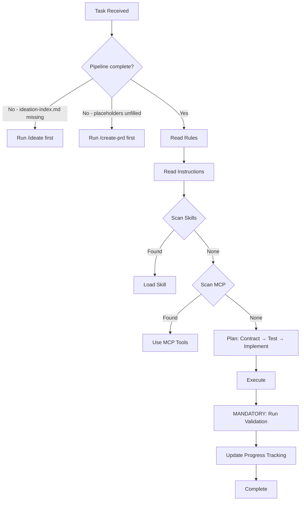

# CFSA Antigravity — Constraint-First Specification Architecture

This is a **Constraint-First Specification Architecture (CFSA)** pipeline. It turns a raw idea into exhaustively specified, test-driven, production-quality code through a series of progressive gates. Stack-agnostic. Agent-agnostic. Cross-platform. Every line of code, every spec, every test is production-grade from the moment it's written. Phases control scope, never quality. There is no "fix it later."

### Entry Point

Start the pipeline with:

```
/ideate                              # From scratch — deep interview
/ideate @path/to/your-idea.md        # From existing document
```

The `@file` pattern is natively supported by `/ideate` (with full multi-mode input classification) and as a simple document-read input by `/evolve-feature`, `/resolve-ambiguity`, and `/propagate-decision`. Other pipeline commands accept direct invocation; `@file` can be passed to them but no automatic input classification is applied — the workflow reads the file and treats it as inline context.

### Progressive Decision Lock

Decisions in this pipeline are **progressively locked**. Each pipeline stage builds on the locked decisions of previous stages:

1. `/ideate` locks the **vision** — problem, personas, features, constraints
2. `/create-prd` locks the **architecture** — tech stack, system design, security model
3. `/decompose-architecture` locks the **domain boundaries** — shard structure, dependencies
4. `/write-architecture-spec` locks the **interaction specs** — per-shard contracts, data models
5. `/write-be-spec` locks the **backend contracts** — API endpoints, schemas, middleware
6. `/write-fe-spec` locks the **frontend specs** — components, state, interactions
7. `/plan-phase` locks the **implementation order** — dependency-ordered TDD slices
7.5. `/verify-infrastructure` locks the **operational foundation** — CI/CD green, staging live, migrations clean, auth working
8. `/implement-slice` locks the **code** — tests → implementation → validation

Once a stage is locked, downstream stages may not contradict it. To change a locked decision, re-run the originating stage and cascade changes downstream.

<!-- Pipeline table maintained by: (1) bootstrap-agents-fill.md Step 4 for project-config sections, (2) kit maintainer checklist for workflow rows — see docs/kit-architecture.md Kit Maintenance Checklist -->
### Pipeline Workflow Table

| # | Command | Input | Output | Stage |
|---|---------|-------|--------|-------|
| 1 | `/ideate` | Raw idea or `@file` | `docs/plans/ideation/` folder + `docs/plans/vision.md` (summary) | Discovery |
| ↳ | `/ideate-extract` | User input | Classified input + `docs/plans/ideation/` folder + loaded skills | Discovery |
| ↳ | `/ideate-discover` | Classified input | Domain files + cross-cut ledger (recursive breadth-before-depth) | Discovery |
| ↳ | `/ideate-validate` | Domains + features | `docs/plans/vision.md` (human summary compiled from ideation folder) | Discovery |
| 2 | `/create-prd` | `ideation-index.md` | `architecture-design.md` + `ENGINEERING-STANDARDS.md` + `data-placement-strategy.md` | Design |

> **Persistent intermediary**: `docs/plans/ideation/` folder — kept permanently as the pipeline's source of truth for the ideation phase.

| ↳ | `/create-prd-stack` | `ideation/meta/constraints.md` | Tech stack decisions | Design |
| ↳ | `/create-prd-design-system` | Tech stack + brand-guidelines | `docs/plans/design-system.md` | Design |
| ↳ | `/create-prd-architecture` | Tech stack | System architecture + data strategy | Design |
| ↳ | `/create-prd-security` | Architecture | Security model + integrations | Design |
| ↳ | `/create-prd-compile` | All prior steps | `architecture-design.md` + `ENGINEERING-STANDARDS.md` | Design |

> **Progressive working artifact**: `docs/plans/architecture-draft.md` — written incrementally by shards 1–3, read by shard 4 to compile the final `architecture-design.md`.

| 3 | `/decompose-architecture` | `architecture-design.md` | IA shards + layer indexes | Design |
| ↳ | `/decompose-architecture-structure` | Approved domains | Directory structure + shard skeletons + indexes | Design |
| ↳ | `/decompose-architecture-validate` | Skeletons | Deep dives + type annotations + validation | Design |
| 4 | `/write-architecture-spec` | Skeleton IA shard | Full interaction spec | Specification |
| ↳ | `/write-architecture-spec-design` | Skeleton shard | Interactions + contracts + data models + access control | Specification |
| ↳ | `/write-architecture-spec-deepen` | Drafted sections | Deepening passes + final spec + ambiguity gate | Specification |
| 5 | `/write-be-spec` | IA shard | Backend specification | Specification |
| ↳ | `/write-be-spec-classify` | IA shard | Classification + source material inventory | Specification |
| ↳ | `/write-be-spec-write` | Classified shard | BE spec + indexes + ambiguity gate | Specification |
| 6 | `/write-fe-spec` | BE spec + IA shard | Frontend specification | Specification |
| ↳ | `/write-fe-spec-classify` | BE spec + IA shard | Classification + source material inventory | Specification |
| ↳ | `/write-fe-spec-write` | Classified target | FE spec + indexes + ambiguity gate | Specification |
| 7 | `/audit-ambiguity` | Any layer | Scored ambiguity report | Quality Gate |
| ↳ | `/audit-ambiguity-rubrics` | Layer selection | Scope + documents + scoring rubrics | Quality Gate |
| ↳ | `/audit-ambiguity-execute` | Rubrics + documents | Per-document audit + report + remediation | Quality Gate |
| | `/resolve-ambiguity` | Any pipeline document or layer | Resolved gaps applied to source documents | Quality Gate |
| | `/remediate-pipeline` | Existing pipeline output | Layer-by-layer audit + remediation + confirmation | Quality Gate |
| ↳ | `/remediate-pipeline-assess` | Pipeline state | Remediation plan + layer status | Quality Gate |
| ↳ | `/remediate-pipeline-execute` | Remediation plan | Clean layers + advancement | Quality Gate |
| | `/propagate-decision` | Locked decision + downstream docs | Corrected specs + propagation record | Correction |
| ↳ | `/propagate-decision-scan` | Decision type selection | Impact report (explicit + implicit) | Correction |
| ↳ | `/propagate-decision-apply` | Impact report | Fixed specs + ambiguity flags | Correction |
| | `/evolve-feature` | New feature/requirement description | Updated specs across all affected layers | Evolution |
| ↳ | `/evolve-feature-classify` | Feature description | Classified change + new content at entry point | Evolution |
| ↳ | `/evolve-feature-cascade` | Classified change + entry point | Layer-by-layer additions + implementation impact | Evolution |
| 8 | `/plan-phase` | Architecture + specs | Dependency-ordered TDD slices | Planning |
| 9 | `/implement-slice` | Slice acceptance criteria | Working code via Red→Green→Refactor | Implementation |
| ↳ | `/implement-slice-setup` | Slice from phase plan | Progress check + skills + contracts + parallel mode | Implementation |
| ↳ | `/implement-slice-tdd` | Contract + tests | Red→Green→Refactor + validation + progress tracking | Implementation |
| 9.5 | `/verify-infrastructure` | Implemented infra or auth slice | Operational verification report | Verification |
| 10 | `/validate-phase` | Completed phase | Full validation gate | Verification |
| 11 | `/evolve-contract` | Changed Zod schema | Safe schema migration | Maintenance |

> **Note**: Rows marked with ↳ are independently-invocable sub-workflows (shards)
> of their parent command. The parent orchestrates them in sequence, but each shard
> can also be run standalone with its own prerequisites. `/bootstrap-agents` is also
> sharded into `/bootstrap-agents-fill` and `/bootstrap-agents-provision`.
> `/resolve-ambiguity`, `/remediate-pipeline`, `/propagate-decision`, and `/evolve-feature` are utility commands callable from any stage — they are not sequential pipeline steps.

> [!WARNING]
> If `docs/plans/ideation/ideation-index.md` does not exist, the pipeline has not started — run `/ideate` before any other workflow.

> [!WARNING]
> If `{{PLACEHOLDER}}` values appear anywhere in this file, bootstrap has not run — do not attempt implementation work.

---

## Project Configuration

# {{PROJECT_NAME}}

{{DESCRIPTION}}

### Tech Stack

**{{TECH_STACK_SUMMARY}}**

### Architecture

- [Architecture Design]({{ARCHITECTURE_DOC}}) — System design document
- [Engineering Standards](docs/plans/ENGINEERING-STANDARDS.md) — Non-negotiable quality bar
- [Data Placement Strategy](docs/plans/data-placement-strategy.md) — Entity placement + PII boundaries

### Agent Instructions

| Guide | Description |
|-------|-------------|
| 🛠️ [Workflow](.agent/instructions/workflow.md) | Execution sequence & principles |
| 💻 [Tech Stack](.agent/instructions/tech-stack.md) | Technology decisions & skill mappings |
| 📐 [Patterns](.agent/instructions/patterns.md) | Code conventions & architecture patterns |
| 📁 [Structure](.agent/instructions/structure.md) | Directory layout & protected files |
| ⌨️ [Commands](.agent/instructions/commands.md) | Dev, test, lint, build commands |

### Agent Rules

Rules in `.agent/rules/` are **always active** — they apply to every task, every session:

| Rule | What It Enforces |
|------|-----------------|
| 🔒 [security-first](.agent/rules/security-first.md) | PII isolation, input validation, secret handling |
| 📜🧪 [tdd-contract-first](.agent/rules/tdd-contract-first.md) | `{{CONTRACT_LIBRARY}}` schemas before implementation, tests ARE the spec |
| 🔲 [vertical-slices](.agent/rules/vertical-slices.md) | All four surfaces or it's not done |
| 🎯📏 [specificity-standards](.agent/rules/specificity-standards.md) | Testable acceptance criteria, exhaustive spec depth |
| 🧩 [extensibility](.agent/rules/extensibility.md) | File limits, directory docs, anti-spaghetti |
| 🚧 [boundary-not-placeholder](.agent/rules/boundary-not-placeholder.md) | Boundary stubs vs banned lazy placeholders |
| 🗣️ [question-vs-command](.agent/rules/question-vs-command.md) | Questions = discuss, Commands = act, Ambiguous = ask |
| 🎯 [decision-classification](.agent/rules/decision-classification.md) | Product = user, Architecture = options, Implementation = agent |
| ✅ [completion-checklist](.agent/rules/completion-checklist.md) | Code ≠ done. Code + tests + tracking = done |

### Installed Skills

{{INSTALLED_SKILLS}}

### Key Principles

1. **Production-grade always** — No throwaway code, no shortcuts, no tech debt by design
2. **Constraints before decisions** — Map what's already decided before presenting options
3. **Contract-first** — `{{CONTRACT_LIBRARY}}` schema → failing test → implementation (never reverse)
4. **TDD: failing test before code** — Red → Green → Refactor, every slice, every surface
5. **Security-first** — PII never leaks, inputs validated, secrets server-side only

### Decision Tree



### Mandatory Validation

**CRITICAL:** Run `{{VALIDATION_COMMAND}}` after **EVERY** code change. Do not finish a task until all pass.
