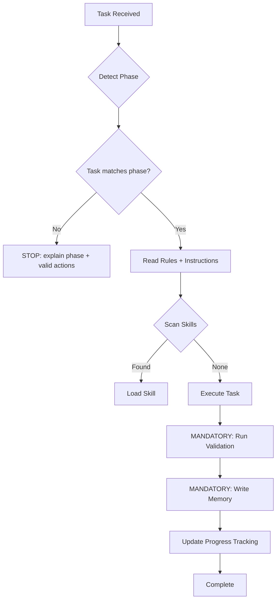

# CFSA Antigravity — Constraint-First Specification Architecture

**CFSA pipeline** — raw idea → exhaustive specs → test-driven production code. Stack/agent-agnostic. Phases control scope, never quality. No "fix it later."

### Entry Point

```
/ideate                              # From scratch — deep interview
/ideate @path/to/your-idea.md        # From existing document
```

`@file` is natively supported by `/ideate` (with multi-mode input classification) and as simple document-read by `/evolve-feature`, `/resolve-ambiguity`, `/propagate-decision`.

### Progressive Decision Lock

Decisions are **progressively locked**: `/ideate` → vision, `/create-prd` → architecture, `/decompose-architecture` → domain boundaries, `/write-architecture-spec` → interaction specs, `/write-be-spec` → backend contracts, `/write-fe-spec` → frontend specs, `/plan-phase` → implementation order, `/setup-workspace` → operational foundation, `/verify-infrastructure` → infrastructure verification, `/implement-slice` → code.

Once locked, downstream stages may not contradict. To change a locked decision, re-run the originating stage and cascade.

<!-- Maintained by bootstrap-agents-fill.md Step 4 + kit maintainer checklist -->
### Pipeline Workflow Table

| # | Command | Input | Output | Stage |
|---|---------|-------|--------|-------|
| 1 | `/ideate` | Raw idea or `@file` | `.memory/wiki/specs/ideation/` folder + `.memory/wiki/specs/vision.md` (summary) | Discovery |
| ↳ | `/ideate-extract` | User input | Classified input + `.memory/wiki/specs/ideation/` folder + loaded skills | Discovery |
| ↳ | `/ideate-discover` | Classified input | Domain files + cross-cut ledger (recursive breadth-before-depth) | Discovery |
| ↳ | `/ideate-validate` | Domains + features | `.memory/wiki/specs/vision.md` (human summary compiled from ideation folder) | Discovery |
| 2 | `/create-prd` | `ideation-index.md` | `architecture-design.md` + `ENGINEERING-STANDARDS.md` + `data-placement-strategy.md` | Design |

| ↳ | `/create-prd-stack` | `ideation/meta/constraints.md` | Tech stack decisions | Design |
| ↳ | `/create-prd-design-system` | Tech stack + brand-guidelines | `.memory/wiki/specs/design-system.md` | Design |
| ↳ | `/create-prd-architecture` | Tech stack | System architecture + data strategy | Design |
| ↳ | `/create-prd-security` | Architecture | Security model + integrations | Design |
| ↳ | `/create-prd-compile` | All prior steps | `architecture-design.md` + `ENGINEERING-STANDARDS.md` | Design |

| 3 | `/decompose-architecture` | `architecture-design.md` | IA shards + layer indexes | Design |
| ↳ | `/decompose-architecture-structure` | Approved domains | Directory structure + shard skeletons + indexes | Design |
| ↳ | `/decompose-architecture-validate` | Skeletons | Deep dives + type annotations + validation | Design |
| 4 | `/write-architecture-spec` | Skeleton IA shard | Full interaction spec | Specification |
| ↳ | `/write-architecture-spec-design` | Skeleton shard | Interactions + contracts + data models + access control | Specification |
| ↳ | `/write-architecture-spec-deepen` | Drafted sections | Deepening passes + final spec + ambiguity gate | Specification |
| 5 | `/write-be-spec` | IA shard | Backend specification | Specification |
| ↳ | `/write-be-spec-classify` | IA shard | Classification + source material inventory | Specification |
| ↳ | `/write-be-spec-write` | Classified shard | BE spec + indexes + ambiguity gate | Specification |
| 6 | `/write-fe-spec` | BE spec + IA shard | Frontend specification | Specification |
| ↳ | `/write-fe-spec-classify` | BE spec + IA shard | Classification + source material inventory | Specification |
| ↳ | `/write-fe-spec-write` | Classified target | FE spec + indexes + ambiguity gate | Specification |
| 7 | `/audit-ambiguity` | Any layer | Scored ambiguity report | Quality Gate |
| ↳ | `/audit-ambiguity-rubrics` | Layer selection | Scope + documents + scoring rubrics | Quality Gate |
| ↳ | `/audit-ambiguity-execute` | Rubrics + documents | Per-document audit + report + remediation | Quality Gate |
| | `/resolve-ambiguity` | Any pipeline document or layer | Resolved gaps applied to source documents | Quality Gate |
| | `/remediate-pipeline` | Existing pipeline output | Layer-by-layer audit + remediation + confirmation | Quality Gate |
| ↳ | `/remediate-pipeline-assess` | Pipeline state | Remediation plan + layer status | Quality Gate |
| ↳ | `/remediate-pipeline-execute` | Remediation plan | Clean layers + advancement | Quality Gate |
| | `/propagate-decision` | Locked decision + downstream docs | Corrected specs + propagation record | Correction |
| ↳ | `/propagate-decision-scan` | Decision type selection | Impact report (explicit + implicit) | Correction |
| ↳ | `/propagate-decision-apply` | Impact report | Fixed specs + ambiguity flags | Correction |
| | `/evolve-feature` | New feature/requirement description | Updated specs across all affected layers | Evolution |
| ↳ | `/evolve-feature-classify` | Feature description | Classified change + new content at entry point | Evolution |
| ↳ | `/evolve-feature-cascade` | Classified change + entry point | Layer-by-layer additions + implementation impact | Evolution |
| | `/remediate-shard-split` | Split parent + sub-shard mapping | Updated cross-references + remediation record | Correction |
| 8 | `/plan-phase` | Architecture + specs | Dependency-ordered TDD slices | Planning |
| ↳ | `/plan-phase-preflight` | Approved specs | Phase gate + completeness audit + consistency check | Planning |
| ↳ | `/plan-phase-write` | Preflight pass | Slices + acceptance criteria + progress files | Planning |
| 8.5 | `/setup-workspace` | Architecture + phase plan | Scaffolded project + CI/CD + staging + database | Setup |
| ↳ | `/setup-workspace-scaffold` | Architecture + structure | Project init + deps + configs + git | Setup |
| ↳ | `/setup-workspace-cicd` | Scaffolded project | CI/CD pipeline config + secrets | Setup |
| ↳ | `/setup-workspace-hosting` | CI/CD configured | Hosting + domains + first staging deploy | Setup |
| ↳ | `/setup-workspace-data` | Hosting configured | Database + migrations + connections | Setup |
| 9 | `/implement-slice` | Slice acceptance criteria | Working code via Red→Green→Refactor | Implementation |
| ↳ | `/implement-slice-setup` | Slice from phase plan | Progress check + skills + contracts + parallel mode | Implementation |
| ↳ | `/implement-slice-tdd` | Contract + tests | Red→Green→Refactor + validation + progress tracking | Implementation |
| 9.5 | `/verify-infrastructure` | Workspace, infra slice, or auth slice | Operational verification report | Verification |
| 10 | `/validate-phase` | Completed phase | Full validation gate | Verification |
| ↳ | `/validate-phase-quality` | Completed phase | Code quality gates — tests, coverage, lint, type-check, build, CI/CD, staging, migrations, spec coverage | Verification |
| ↳ | `/validate-phase-readiness` | Quality gates passed | Production readiness gates — API docs, accessibility, performance, security, dependency audit, results | Verification |
| 11 | `/evolve-contract` | Changed `{{CONTRACT_LIBRARY}}` schema | Safe schema migration | Maintenance |


> **Note**: ↳ rows are independently-invocable shards. Utility commands (`/resolve-ambiguity`, `/remediate-pipeline`, `/propagate-decision`, `/evolve-feature`, `/remediate-shard-split`) are callable from any stage.

> [!WARNING]
> If `.memory/wiki/specs/ideation/ideation-index.md` does not exist, the pipeline has not started — run `/ideate` before any other workflow.

> [!WARNING]
> If `{{PLACEHOLDER}}` values appear in this file: check the current pipeline phase (see below). Pre-PRD → placeholders are expected, they fill at `/create-prd`. Post-PRD → run `/bootstrap-agents-fill`.

---

## Project Configuration

# {{PROJECT_NAME}}

{{DESCRIPTION}}

### Tech Stack

**{{TECH_STACK_SUMMARY}}**

### Architecture

- [Architecture Design]({{ARCHITECTURE_DOC}}) — System design document
- [Engineering Standards](.memory/wiki/specs/ENGINEERING-STANDARDS.md) — Non-negotiable quality bar
- [Data Placement Strategy](.memory/wiki/specs/data-placement-strategy.md) — Entity placement + PII boundaries

### Agent Instructions

| Guide | Description |
|-------|-------------|
| 🛠️ [Workflow](.agents/instructions/workflow.md) | Execution sequence |
| 💻 [Tech Stack](.agents/instructions/tech-stack.md) | Technology decisions |
| 📐 [Patterns](.agents/instructions/patterns.md) | Code conventions |
| 📁 [Structure](.agents/instructions/structure.md) | Directory layout |
| ⌨️ [Commands](.agents/instructions/commands.md) | Dev, test, lint, build |

### Agent Rules

Rules in `.agents/rules/` are **always active** — they apply to every task, every session:

| Rule | What It Enforces |
|------|-----------------|
| 🔒 [security-first](.agents/rules/security-first.md) | PII isolation, input validation, secret handling |
| 📜🧪 [tdd-contract-first](.agents/rules/tdd-contract-first.md) | `{{CONTRACT_LIBRARY}}` schemas before implementation, tests ARE the spec |
| 🔲 [vertical-slices](.agents/rules/vertical-slices.md) | All four surfaces or it's not done |
| 🎯📏 [specificity-standards](.agents/rules/specificity-standards.md) | Testable acceptance criteria, exhaustive spec depth |
| 🧩 [extensibility](.agents/rules/extensibility.md) | File limits, directory docs, anti-spaghetti |
| 🚧 [boundary-not-placeholder](.agents/rules/boundary-not-placeholder.md) | Boundary stubs vs banned lazy placeholders |
| 🗣️ [question-vs-command](.agents/rules/question-vs-command.md) | Questions = discuss, Commands = act, Ambiguous = ask |
| 🎯 [decision-classification](.agents/rules/decision-classification.md) | Product = user, Architecture = options, Implementation = agent |
| ✅ [completion-checklist](.agents/rules/completion-checklist.md) | Code ≠ done. Code + tests + tracking = done |
| 🧠 [memory-capture](.agents/rules/memory-capture.md) | Patterns, decisions, blockers written every conversation |
| 🔢 [single-question](.agents/rules/single-question.md) | One question at a time, options + pros/cons + recommendation |
| 🐛 [debug-by-test](.agents/rules/debug-by-test.md) | Failing test before any fix — reproduce first, fix second |
| 🔍 [skill-mcp-first](.agents/rules/skill-mcp-first.md) | Check skills and MCPs before reasoning on your own |
| 📖 [source-before-ask](.agents/rules/source-before-ask.md) | Read relevant source docs before every question — no decisions from summaries |

### Installed Skills

{{INSTALLED_SKILLS}}

### Key Principles

1. **Production-grade always** — No throwaway code, no shortcuts, no tech debt by design
2. **Constraints before decisions** — Map what's already decided before presenting options
3. **Contract-first** — `{{CONTRACT_LIBRARY}}` schema → failing test → implementation (never reverse)
4. **TDD: failing test before code** — Red → Green → Refactor, every slice, every surface
5. **Security-first** — PII never leaks, inputs validated, secrets server-side only
6. **Write decisions to disk immediately** — Every confirmed decision is written to its output file the moment the user confirms it. Never batch decisions in-memory across a long conversation. If the conversation truncates, all confirmed work must survive on disk.
7. **Write to unified memory every conversation** — Before ending any workflow or conversation, write patterns to `.memory/wiki/patterns.md`, decisions to `.memory/wiki/decisions.md`, blockers to `.memory/wiki/blockers.md`, and prefer the shared MCP memory tools when available. See rule: `memory-capture`.
8. **Use the shared memory daemon** — The project owns one `cfsa-memory` daemon under `.memory/mcp-server/daemon.mjs`. Gemini/Antigravity-style runtimes should connect through MCP client config to `.mcp.json` -> `cfsa-memory` -> `.memory/mcp-server/client.mjs` instead of spawning isolated memory servers.

### Pipeline Phase Detection

Before acting on any task, detect the current pipeline phase from filesystem markers:

| Phase | Marker | Valid Actions |
|-------|--------|---------------|
| Pre-ideation | No `.memory/wiki/specs/ideation/ideation-index.md` | Only `/ideate` |
| Ideating | `ideation/` has content, no `vision.md` | Ideation workflows only |
| Ideation complete | `ideation-index.md` + `vision.md` exist | `/audit-ambiguity` → `/create-prd` |
| PRD in progress | `architecture-draft.md` exists | PRD workflows only |
| PRD complete | `architecture-design.md` + `ENGINEERING-STANDARDS.md` | `/decompose-architecture` |
| Decomposition done | IA shards in `.memory/wiki/specs/ia/` | `/write-architecture-spec` |
| Spec writing | BE/FE specs exist | `/write-be-spec`, `/write-fe-spec` |
| Planning | Phase plan in `.memory/wiki/specs/phases/` | `/plan-phase` |
| Workspace setup | Phase plan exists, no `.memory/pipeline/progress/` content | `/setup-workspace` → `/verify-infrastructure` |
| Implementation | `.memory/pipeline/progress/` has content | `/implement-slice` |

**Use this table to gate every action.** If a user runs a command that doesn't match their current phase, explain what phase they're in and what to run instead.

### Decision Tree



### Mandatory Validation

Run the Validation Cmd from `.agents/instructions/commands.md` after **EVERY** code change. Do not finish a task until all pass.
