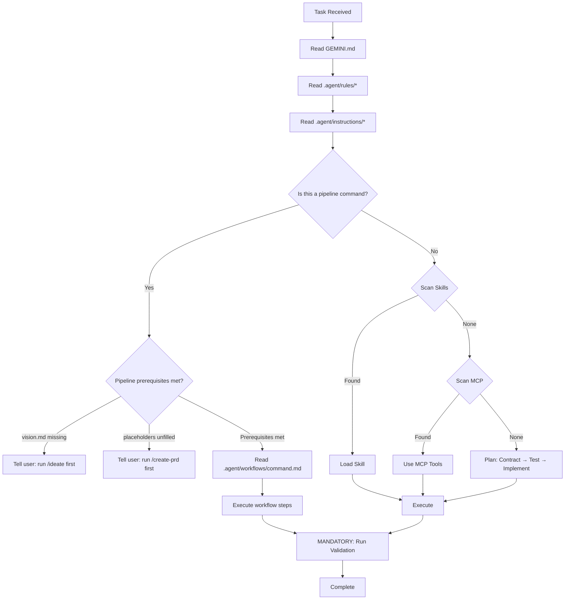

# {{PROJECT_NAME}}

{{DESCRIPTION}}

---

## Pre-Pipeline Orientation

This is a **Spec Pipeline Starter Kit** project — a workflow toolkit that builds 
production-grade software from line one. Stack-agnostic. Agent-agnostic. Cross-platform.

> **This project does not build MVPs.** Every line of code, every spec, every
> test is production-grade from the moment it's written. Phases control scope,
> never quality. There is no "fix it later."

### Progressive Decision Lock

Decisions in this pipeline are **progressively locked**. Each pipeline stage
builds on the locked decisions of previous stages:

1. `/ideate` locks the **vision** — problem, personas, features, constraints
2. `/create-prd` locks the **architecture** — tech stack, system design, security model
3. `/decompose-architecture` locks the **domain boundaries** — shard structure, dependencies
4. `/write-architecture-spec` locks the **interaction specs** — per-shard contracts, data models
5. `/write-be-spec` locks the **backend contracts** — API endpoints, schemas, middleware
6. `/write-fe-spec` locks the **frontend specs** — components, state, interactions
7. `/plan-phase` locks the **implementation order** — dependency-ordered TDD slices
8. `/implement-slice` locks the **code** — tests → implementation → validation

Once a stage is locked, downstream stages may not contradict it. To change a
locked decision, re-run the originating stage and cascade changes downstream.

### Pipeline Workflow Table

| # | Command | Input | Output | Stage |
|---|---------|-------|--------|-------|
| 1 | `/ideate` | Raw idea or `@file` | `docs/plans/vision.md` | Discovery |
| 2 | `/create-prd` | `vision.md` | `architecture-design.md` + `ENGINEERING-STANDARDS.md` + `data-placement-strategy.md` | Design |
| 3 | `/decompose-architecture` | `architecture-design.md` | IA shards + layer indexes | Design |
| 4 | `/write-architecture-spec` | Skeleton IA shard | Full interaction spec | Specification |
| 5 | `/write-be-spec` | IA shard | Backend specification | Specification |
| 6 | `/write-fe-spec` | BE spec + IA shard | Frontend specification | Specification |
| 7 | `/audit-ambiguity` | Any layer | Scored ambiguity report | Quality Gate |
| 8 | `/plan-phase` | Architecture + specs | Dependency-ordered TDD slices | Planning |
| 9 | `/implement-slice` | Slice acceptance criteria | Working code via Red→Green→Refactor | Implementation |
| 10 | `/validate-phase` | Completed phase | Full validation gate | Verification |
| 11 | `/evolve-contract` | Changed Zod schema | Safe schema migration | Maintenance |
| 12 | `/sync-kit` | Upstream starter kit | Merged improvements | Maintenance |

### Warnings

> [!WARNING]
> If `docs/plans/vision.md` does not exist, the only valid command is `/ideate`.
> All other pipeline commands require a vision document. Run `/ideate` first.

> [!WARNING]
> If `{{PLACEHOLDER}}` values appear below (in the Project Configuration section),
> the PRD workflow has not been completed. Run `/create-prd` to fill them.
> Do not begin implementation work with unfilled placeholders.

### Entry Point

Start the pipeline with:

```
/ideate                              # From scratch — deep interview
/ideate @path/to/your-idea.md        # From existing document
```

The `@file` pattern works with any pipeline command. The workflow reads the 
referenced file and detects the input type automatically.

### Decision Tree



---

## Project Configuration

> [!IMPORTANT]
> Everything below this line contains `{{PLACEHOLDER}}` values that get filled
> by `/bootstrap-agents` during `/create-prd`. If you see unfilled placeholders,
> the PRD workflow has not been completed — run `/create-prd` first.

### Tech Stack

**{{TECH_STACK_SUMMARY}}**

### Development Methodology

This project follows **Contract-First Progressive Architecture (CFPA)**:

```
Contract (Zod schema) → Tests (failing) → Implementation (make them pass) → Never reverse this.
```

- [Architecture Design](docs/plans/architecture-design.md) — System design document
- [Engineering Standards](docs/plans/ENGINEERING-STANDARDS.md) — Non-negotiable quality bar
- [Data Placement Strategy](docs/plans/data-placement-strategy.md) — Entity placement + PII boundaries

### Agent Instructions

| Guide | Description |
|-------|-------------|
| 🛠️ [Workflow](.agent/instructions/workflow.md) | Execution sequence & principles |
| 💻 [Tech Stack](.agent/instructions/tech-stack.md) | Technology decisions & skill mappings |
| 📐 [Patterns](.agent/instructions/patterns.md) | Code conventions & architecture patterns |
| 📁 [Structure](.agent/instructions/structure.md) | Directory layout & protected files |
| ⌨️ [Commands](.agent/instructions/commands.md) | Dev, test, lint, build commands |

### Agent Rules

Rules in `.agent/rules/` are **always active** — they apply to every task, every session:

| Rule | What It Enforces |
|------|-----------------|
| 🔒 [security-first](.agent/rules/security-first.md) | PII isolation, input validation, secret handling |
| 📜🧪 [tdd-contract-first](.agent/rules/tdd-contract-first.md) | Zod schemas before implementation, tests ARE the spec |
| 🔲 [vertical-slices](.agent/rules/vertical-slices.md) | All four surfaces or it's not done |
| 🎯📏 [specificity-standards](.agent/rules/specificity-standards.md) | Testable acceptance criteria, exhaustive spec depth |
| 🧩 [extensibility](.agent/rules/extensibility.md) | File limits, directory docs, anti-spaghetti |
| 🚧 [boundary-not-placeholder](.agent/rules/boundary-not-placeholder.md) | Boundary stubs vs banned lazy placeholders |
| 🗣️ [question-vs-command](.agent/rules/question-vs-command.md) | Questions = discuss, Commands = act, Ambiguous = ask |
| 🎯 [decision-classification](.agent/rules/decision-classification.md) | Product = user, Architecture = options, Implementation = agent |
| ✅ [completion-checklist](.agent/rules/completion-checklist.md) | Code ≠ done. Code + tests + tracking = done |

### Installed Skills

{{INSTALLED_SKILLS}}

### Key Principles

1. **Production-grade from line one** — No throwaway code, no shortcuts, no tech debt by design
2. **Cost-blind execution** — Your operational cost (API calls, tokens, compute) is never a factor
3. **Proactive effort** — Big task? Commit harder. Never defer or reduce quality
4. **Security first** — PII never leaks, inputs validated, secrets server-side only
5. **Contract-first** — Zod schema → failing test → implementation (never reverse)
6. **Context-window aware** — Small files, clear exports, TypeScript strict
7. **Accessible and performant** — WCAG 2.1, Core Web Vitals, responsive

### Mandatory Validation

**CRITICAL:** Run `{{VALIDATION_COMMAND}}` after **EVERY** code change. Do not finish a task until all pass.
