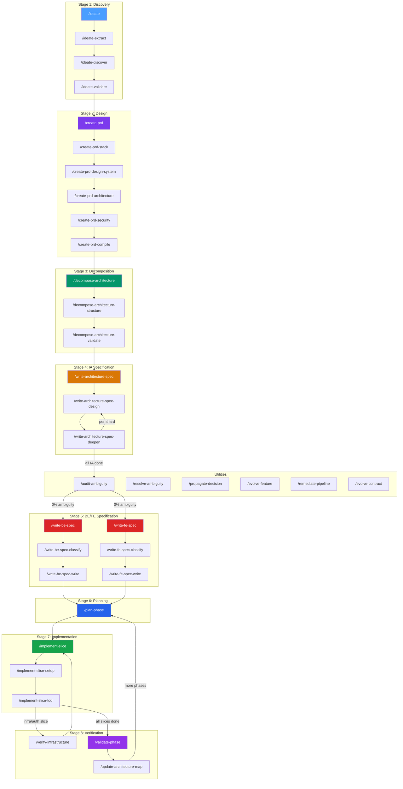

# Full Pipeline Audit Report

**Date**: 2026-03-14
**Scope**: All workflows from `/ideate` through `/validate-phase` plus all utility workflows
**Files Audited**: 47 workflow files (317,863 bytes total)

---

## Executive Summary

The CFSA Antigravity pipeline is **architecturally sound** — the progressive decision lock model, layered specification approach, and rigorous ambiguity gates create a genuinely robust specification-to-implementation system. However, this audit uncovered **16 actionable issues** including hardcoded project-specific skills bypassing the placeholder system, a MANIFEST-to-library desync (19 missing skills), and near-limit workflow sizes, plus **3 strategic recommendations** for Mermaid integration, debugging robustness, and layer sufficiency.

| Severity | Count | Category |
|----------|-------|----------|
| 🔴 Critical | 5 | Hardcoded skills bypassing placeholders (×3), duplicated logic, missing debugging entry |
| 🟡 Moderate | 6 | Near-limit workflows, shallow parents, missing gates, MANIFEST desync |
| 🔵 Advisory | 5 | Optimization opportunities, strategic enhancements |

---

## Pipeline Overview Mermaid



---

## Size Audit (12,000 Character Limit)

> **Counting method**: `wc -m` (character count). Antigravity's internal count excludes YAML frontmatter (~300–500 chars), so its reported numbers are lower than raw `wc -m`. Percentages below use raw character counts as the conservative measure.

| Status | Workflow | Chars | % of Limit |
|--------|----------|-------|------------|
| 🟡 Near limit | `write-architecture-spec-design.md` | 11,944 | 99.5% |
| 🟡 Near limit | `write-fe-spec-classify.md` | 11,514 | 96% |
| 🟡 Near limit | `implement-slice-tdd.md` | 11,417 | 95% |
| 🟡 Near limit | `plan-phase.md` | 11,314 | 94% |
| 🟡 Near limit | `validate-phase.md` | 11,101 | 93% |
| 🟡 Near limit | `audit-ambiguity-execute.md` | 10,892 | 91% |
| ✅ Comfortable | `ideate-discover.md` | 10,681 | 89% |
| ✅ Comfortable | `bootstrap-agents-provision.md` | 10,604 | 88% |
| ✅ Comfortable | `sync-kit.md` | 10,197 | 85% |
| ✅ Comfortable | `create-prd.md` | 9,950 | 83% |
| ✅ OK | All others | <10,000 | <83% |

### Recommendations

1. **`write-architecture-spec-design.md`** — At 99.5% of the 12K character limit. Any non-trivial edit will exceed it. The `rest-api-design` skill reference removal (see Issue #1) buys ~60 chars. Consider extracting the "Authoring pattern for Steps 2–7" guidance into the `spec-writing` skill.

2. **Five workflows at 91–96%** — These have ~500–1,100 chars of headroom. Future additions will push them over. For each, identify inline guidance that belongs in skills (particularly the review question templates and reconciliation table formats).

---

## Issues Found

### 🔴 Critical Issues

#### Issue 1: Hardcoded Project-Specific Skill — `rest-api-design`

**Affected workflows**:
- `write-architecture-spec-design.md` (line 98): `Read .agent/skills/rest-api-design/SKILL.md`
- `write-be-spec-classify.md` (line 90): `Read .agent/skills/rest-api-design/SKILL.md`
- `create-prd.md` (line 53): listed in skill bootstrap section
- `create-prd-architecture.md` (line 43): `Read .agent/skills/rest-api-design/SKILL.md`

**Problem**: `rest-api-design` is hardcoded as if every project uses REST APIs. REST is a **project-specific API style choice** — projects could equally use GraphQL, tRPC, gRPC, or another pattern. This skill reference should be a `{{API_DESIGN_SKILL}}` placeholder that `/bootstrap-agents` fills from the skill library based on the API style decision made during `/create-prd-stack`.

Hardcoding `rest-api-design` means:
1. Non-REST projects will hit a missing-skill error (the directory doesn't exist in the base kit)
2. Even if the skill existed, it would apply the wrong design conventions to GraphQL/tRPC/gRPC projects
3. The community `api-design-principles` skill exists but is generic — it shouldn't replace `rest-api-design` either, since that's still a hardcoded assumption

**Fix**:
1. Replace all `rest-api-design` references with `{{API_DESIGN_SKILL}}` in the four affected workflows
2. Add `API_DESIGN_SKILL` to the `requires_placeholders` frontmatter in `write-architecture-spec-design.md` and `write-be-spec-classify.md`
3. Add `API_DESIGN_SKILL` to the placeholder guard tables in those workflows
4. Update `/create-prd-stack` to set `API_DESIGN_SKILL` based on the confirmed API style (REST → `rest-api-design`, GraphQL → `graphql-api-design`, etc.)
5. Add the corresponding skill entries to `.agent/skill-library/MANIFEST.md`
6. Update `/bootstrap-agents` to provision the API design skill when `API_STYLE` is confirmed

---

#### Issue 1a: Full Hardcoded Skill Audit

A full scan of all 47 workflows found **38 unique hardcoded skill names** and **11 `{{*_SKILL}}` placeholder slots**. The classification below identifies which hardcoded skills are correctly kit-universal and which should be placeholders.

**Existing placeholder slots** (correctly project-specific):
`{{ACCESSIBILITY_SKILL}}`, `{{AUTH_SKILL}}`, `{{BACKEND_FRAMEWORK_SKILL}}`, `{{CI_CD_SKILL}}`, `{{FRONTEND_DESIGN_SKILL}}`, `{{FRONTEND_FRAMEWORK_SKILL}}`, `{{HOSTING_SKILL}}`, `{{LANGUAGE_SKILL}}`, `{{ORM_SKILL}}`, `{{STATE_MANAGEMENT_SKILL}}`, `{{UNIT_TESTING_SKILL}}`

##### ✅ Correctly Hardcoded (Kit-Universal — Apply to ALL Projects)

These are methodology/process skills that are stack-agnostic and should always be available:

| Skill | Why Kit-Universal |
|-------|------------------|
| `technical-writer` | Writing quality is stack-independent |
| `code-review-pro` | Review methodology is stack-independent |
| `resolve-ambiguity` | Gap resolution is stack-independent |
| `brainstorming` | Ideation is stack-independent |
| `tdd-workflow` | TDD methodology is stack-independent |
| `clean-code` | Code quality principles are stack-independent |
| `systematic-debugging` | Debug methodology is stack-independent |
| `verification-before-completion` | Verification is stack-independent |
| `architecture-mapping` | Architecture analysis is stack-independent |
| `pipeline-rubrics` | Rubric scoring is stack-independent |
| `testing-strategist` | Test strategy is stack-independent |
| `deployment-procedures` | Deployment principles are stack-independent |
| `session-continuity` | Progress tracking is stack-independent |
| `idea-extraction` | Idea extraction is stack-independent |
| `prd-templates` | Document templates are stack-independent |
| `spec-writing` | Spec methodology is stack-independent |
| `brand-guidelines` | Design direction is stack-independent |
| `design-direction` | Design discovery is stack-independent |
| `concise-planning` | Planning methodology is stack-independent |
| `find-skills` | Skill discovery is stack-independent |
| `parallel-agents` | Parallel execution is stack-independent |
| `parallel-feature-development` | Parallel dev coordination is stack-independent |
| `performance-budgeting` | Budget methodology is stack-independent |
| `error-handling-patterns` | Error patterns are stack-independent |
| `migration-management` | Migration strategy is stack-independent |
| `logging-best-practices` | Logging principles are stack-independent |
| `tech-stack-catalog` | Stack decision tables are by definition universal |
| `security-scanning-security-hardening` | Security methodology is stack-independent |

##### 🔴 Improperly Hardcoded (Should Be Placeholders)

| Skill | Problem | Placeholder Needed | Affected Workflows |
|-------|---------|-------------------|-------------------|
| `rest-api-design` | Assumes REST API style | `{{API_DESIGN_SKILL}}` (new) | 4 files — see Issue #1 |
| `accessibility` | Hardcoded in 3 FE workflows **despite `{{ACCESSIBILITY_SKILL}}` placeholder already existing** | `{{ACCESSIBILITY_SKILL}}` (exists!) | `write-fe-spec-write.md`, `write-architecture-spec-design.md`, `validate-phase.md` |
| `api-design-principles` | Hardcoded generic API skill — if a project uses GraphQL, this may not apply | `{{API_DESIGN_SKILL}}` (shared with `rest-api-design` fix) | `create-prd-architecture.md`, `create-prd.md`, `write-be-spec-classify.md` |
| `database-schema-design` | Assumes relational DB design patterns — NoSQL/graph projects may need different skill | `{{DB_DESIGN_SKILL}}` or fold into `{{DATABASE_SKILLS}}` | `create-prd-architecture.md`, `create-prd-stack.md`, `write-architecture-spec-design.md`, `write-be-spec-classify.md` |

> **Critical**: `accessibility` is **the worst offender** — the kit already defined `{{ACCESSIBILITY_SKILL}}` as a placeholder, meaning someone recognized it's project-specific, but 3 workflows bypass the placeholder entirely and hardcode the skill name. This means even if bootstrap sets `{{ACCESSIBILITY_SKILL}}` to a mobile accessibility skill, the FE spec workflow will still load the web WCAG skill.

##### � `validate-phase.md` Bypasses `{{SECURITY_SKILLS}}` Placeholder

The following 7 skills were initially flagged as "phantom" (non-existent), but **they all exist in the skill library** — they're conditional installs triggered by surface type and stack choices:

| Skill | Library Path | Installed By |
|-------|--------------|--------------|
| `owasp-web-security` | `stack/security/owasp-web-security` | Web surface trigger |
| `api-security-checklist` | `surface/api/api-security-checklist` | API surface trigger |
| `crypto-patterns` | `stack/security/crypto-patterns` | Security stack trigger |
| `csp-cors-headers` | `stack/security/csp-cors-headers` | Web surface trigger |
| `input-sanitization` | `stack/security/input-sanitization` | Web surface trigger |
| `dependency-auditing` | `stack/security/dependency-auditing` | Universal trigger |
| `web-performance-optimization` | `surface/web/web-performance-optimization` | Web surface trigger |

**The real bug**: `{{SECURITY_SKILLS}}` already exists as an accumulated placeholder — `create-prd-security.md` (line 48) and `write-architecture-spec-design.md` (line 164) correctly read it. But `validate-phase.md` (lines 184-190) **bypasses the placeholder entirely** and hardcodes these 6 security skill names with "if installed" checks. This means:
- If bootstrap adds a new security skill to `{{SECURITY_SKILLS}}`, `validate-phase` won't know about it
- The hardcoded list will drift out of sync with what bootstrap actually installs
- It duplicates skill discovery logic that bootstrap already handles

**Fix**: Replace lines 184-190 with: `For each skill in {{SECURITY_SKILLS}}, read .agent/skills/[skill]/SKILL.md and run its audit protocol as a supplement to the core audit.`

Same for `accessibility` on line 162: Replace `Read .agent/skills/accessibility/SKILL.md` → `Read .agent/skills/{{ACCESSIBILITY_SKILL}}/SKILL.md`

##### 🔴 MANIFEST vs Skill Library Desync

**19 MANIFEST entries promise skills that don't exist on disk** — if a user picks one of these during `/create-prd-stack`, bootstrap will try to install it and silently fail:

| Category | Missing Skills |
|----------|----------------|
| Auth | `lucia`, `supabase-auth` |
| Extensions | `plasmo`, `wxt` |
| Feature Flags | `flagsmith`, `launchdarkly`, `posthog-flags` |
| Messaging | `nats`, `rabbitmq`, `sqs` |
| Mobile | `kotlin-compose`, `swiftui` |
| Notifications | `fcm`, `sendgrid`, `twilio` |
| Search | `algolia`, `typesense` |
| Storage | `cloudflare-r2`, `gcs` |

**1 skill exists on disk but has no MANIFEST entry** (bootstrap can never install it):
- `stack/mobile/expo-react-native` — has a SKILL.md but no MANIFEST trigger

**Fix**: Either create the 19 missing skills or remove their MANIFEST entries until they exist. Add a MANIFEST entry for `expo-react-native`.

#### Issue 2: Duplicated Self-Check Logic in Ideation

**Affected workflows**:
- `ideate.md` (Step 12: Quality self-check)
- `ideate-validate.md` (Step 12: Quality self-check)

**Problem**: Both the parent orchestrator and its validate shard contain identical self-check steps. When run as a parent→shard sequence, the self-check executes twice. When the validate shard is run standalone, it correctly runs once. But the parent's Step 12 is redundant.

**Fix**: Remove the self-check from the parent `ideate.md` — it belongs exclusively in `ideate-validate.md`. The parent should trust its shard to handle quality gates.

---

#### Issue 3: No Formal Debugging Entry Point in TDD Cycle

**Affected workflow**: `implement-slice-tdd.md`

**Problem**: When tests fail during the GREEN phase (Step 4), the workflow says "Write the minimum code to make all tests pass" but provides no structured guidance for what happens when tests don't pass after reasonable implementation effort. The `systematic-debugging` skill is listed in the bundle but never explicitly invoked in the failure path.

**Fix**: Add a **Step 4.1: Debug cycle** between GREEN and REFACTOR:

```markdown
## 4.1. Debug cycle (if tests fail after initial implementation)

If `{{TEST_COMMAND}}` shows failures after completing Step 4:

Read .agent/skills/systematic-debugging/SKILL.md and follow its ACH methodology.
Read .agent/skills/parallel-debugging/SKILL.md if failures span multiple subsystems.

1. Classify failures: contract mismatch vs logic error vs integration issue
2. For contract mismatches: re-read the BE spec — is the contract wrong or the implementation?
3. For logic errors: apply ACH (Analysis of Competing Hypotheses) per the debugging skill
4. For integration issues: check cross-surface wiring, env vars, service connectivity
5. Maximum 3 debug iterations before escalating to user with findings
```

---

### 🟡 Moderate Issues

#### Issue 4: Thin Parent Orchestrators

Several parent workflows are extremely thin and barely add value beyond listing their shards:

| Parent | Bytes | Shards | Issue |
|--------|-------|--------|-------|
| `implement-slice.md` | 2,149 | 2 | Quality gate is just a checklist with placeholders |
| `write-be-spec.md` | 3,273 | 2 | Skill bootstrap section duplicates shard logic |
| `write-fe-spec.md` | 3,083 | 2 | Same duplication pattern |
| `write-architecture-spec.md` | 2,966 | 2 | Minimal orchestration value |

**Observation**: These parents are fine structurally — they provide the shard table, orchestration summary, and quality gate. But the quality gates partially duplicate what their shards already check. This isn't harmful but creates maintenance burden.

**Recommendation**: Consider whether parent quality gates should be "summary reminders" (current state) or "additional cross-shard checks" (higher value). If the latter, add cross-shard consistency checks that individual shards can't perform.

---

#### Issue 5: BE/FE Spec Parallelism Has No Ordering Enforcement

**Affected workflows**: `write-be-spec.md`, `write-fe-spec.md`

**Problem**: Both workflows declare `parallel-with: [write-be-spec/write-fe-spec]` in their frontmatter, suggesting they can run concurrently. However, `write-fe-spec-classify.md` (Step 0.5, line 23) has a prerequisite: "BE spec(s) for this feature must be complete." This creates a contradiction — the FE spec classify shard requires a completed BE spec, but the parent says they're parallel.

**Fix**: Clarify the parallelism model:
- **Option A**: BE and FE spec *workflows* can run in parallel across *different* IA shards (shard 01 BE + shard 02 FE simultaneously), but for the *same* IA shard, BE must complete before FE.
- **Option B**: Remove the `parallel-with` claim entirely since the prerequisite chain makes true parallelism impossible for the same domain.

Document whichever is correct in both parent frontmatters.

---

#### Issue 6: Missing `// turbo-all` in Some Workflows

**Affected workflows**: `implement-slice.md`, `bootstrap-agents.md`

**Problem**: Most workflows include `// turbo-all` to enable auto-running of all command steps. These two parents do not have it. While the shards do, the parent orchestrators are inconsistent.

**Recommendation**: Add `// turbo-all` to all parent orchestrators for consistency, or document why specific parents intentionally omit it.

---

#### Issue 7: `validate-phase.md` Bypasses `{{SECURITY_SKILLS}}` and `{{ACCESSIBILITY_SKILL}}` Placeholders

**Affected workflow**: `validate-phase.md` (lines 162, 184–191)

**Problem**: `validate-phase.md` hardcodes 7 skill names that should use placeholders:
- Line 162: hardcodes `accessibility` instead of `{{ACCESSIBILITY_SKILL}}`
- Lines 184-190: hardcodes 6 security skill names instead of reading `{{SECURITY_SKILLS}}`

This is the **same bug pattern** as Issue #1 (`rest-api-design`). The placeholder mechanism exists and is used correctly by `create-prd-security.md` and `write-architecture-spec-design.md`, but `validate-phase.md` bypasses it. All 7 skills exist in the skill library as conditional installs — the references are not dead, they're just hardcoded when they should be dynamic.

**Fix**: 
- Replace `Read .agent/skills/accessibility/SKILL.md` → `Read .agent/skills/{{ACCESSIBILITY_SKILL}}/SKILL.md`
- Replace the 6 hardcoded security skill names → `For each skill in {{SECURITY_SKILLS}}, read .agent/skills/[skill]/SKILL.md`

---

#### Issue 8: No `{{SURFACES}}` Placeholder Guard

**Affected workflow**: `write-architecture-spec-design.md` (line 137)

**Problem**: Step 5.5 reads `{{SURFACES}}` to determine target surfaces, but there's no placeholder guard checking whether this value has been filled. Other placeholders (`DATABASE_SKILLS`, `SECURITY_SKILLS`) are guarded in Step 0.

**Fix**: Add `SURFACES` to the `requires_placeholders` frontmatter and the Step 0 placeholder guard table.

---

#### Issue 9: `plan-phase.md` References `{{CI_CD_SKILL}}` and `{{HOSTING_SKILL}}` Without Guard

**Affected workflow**: `plan-phase.md` (line 141)

**Problem**: Step 3 references `{{CI_CD_SKILL}}` and `{{HOSTING_SKILL}}` in the Phase 1 special rule, but these aren't in the `requires_placeholders` frontmatter. The Bootstrap Completeness Gate (Step 6.5) catches them later, but by then the workflow has already used them in Step 3.

**Fix**: Either add these to `requires_placeholders` with a Step 0 placeholder guard, or move the Phase 1 special rule after the Bootstrap Completeness Gate.

---

### 🔵 Advisory Issues

#### Issue 10: Workflow Step Numbering Inconsistencies

Several workflows have non-sequential step numbering due to incremental additions:
- `write-architecture-spec-design.md`: Steps 0, 0.5, 1, 1a, 1b, 1c, 2, 3, 4, 5, 5.5, 6, 7, 7.5, 8
- `verify-infrastructure.md`: Steps 0, 0.5, 0.6, 1, 2, 3, 4, 5, 6, 6.5, 6.6, 7-8, 9
- `plan-phase.md`: Steps 0, 0.1, 0.5, 0.6, 0.8, 1, 2, 3, 4, 4.5, 5, 6, 6.5, 7

**Observation**: The fractional numbering (.5, .6, .75) indicates post-initial-design additions. While functional, it makes maintenance harder and suggests some workflows have grown organically.

**Recommendation**: No action required unless a workflow is being refactored for other reasons. At that point, renumber sequentially.

---

#### Issue 11: No Architecture Map Gate Before Phase 2+

**Affected workflow**: `plan-phase.md`

**Problem**: The architecture map freshness check (Step 0) is a *warning*, not a hard stop. For Phase 2+, an outdated `ARCHITECTURE.md` could mislead the planning process.

**Recommendation**: Consider making this a hard stop for Phase 3+, where structural drift is more dangerous.

---

#### Issue 12: `evolve-contract.md` Doesn't State When To Use It

**Affected workflow**: `evolve-contract.md`

**Problem**: Unlike other utility workflows, `evolve-contract.md` has no "When to use this" / "When NOT to use this" section. It's unclear when an agent should reach for `/evolve-contract` versus just editing the schema manually.

**Fix**: Add a usage guidance section matching the pattern in `evolve-feature.md` and `propagate-decision.md`.

---

#### Issue 13: Missing Cross-Reference Between `verify-infrastructure` and `validate-phase`

**Problem**: Both workflows check CI/CD, deployments, and migrations — but `validate-phase` doesn't reference or build on `verify-infrastructure` results. For Phase 1, the infrastructure verification report exists in `docs/audits/`, but `validate-phase` doesn't check it.

**Recommendation**: Add a Step 0 to `validate-phase` that reads the latest `verify-infrastructure` report and confirms it's still green. This avoids re-running identical checks.

---

#### Issue 14: No Explicit "When All Phases Are Done" Workflow

**Problem**: The pipeline covers ideation through phase validation, but there's no explicit workflow for what happens after the final phase validates. `update-architecture-map.md` proposes "if all phases are complete, the project is ready for deployment" but doesn't define a final gate.

**Recommendation**: Consider a `/finalize-project` or `/ship` workflow that runs a final comprehensive check: all phases validated, architecture map current, no BOUNDARY stubs remaining, documentation complete.

---

## Strategic Recommendations

### Recommendation A: Mermaid Chart Integration

**Where**: At three key pipeline gates

1. **After `/decompose-architecture-validate`** — Generate a Mermaid dependency graph of all IA shards with their inter-shard dependencies. This visualizes circular dependencies and orphaned shards before spec writing begins.

```markdown
## Proposed Step 12.5: Generate Shard Dependency Diagram

Generate a Mermaid `graph TD` diagram showing:
- Each IA shard as a node (numbered, named)
- Cross-shard dependencies as directed edges
- Deep dive files as sub-nodes
- Document type annotations as node colors

Write the diagram to `docs/plans/ia/shard-dependency-diagram.md`.
Include it in the decomposition review presented to the user.
```

2. **After all BE specs complete** — Generate an API route map showing all endpoints, their HTTP methods, auth requirements, and which IA shard they trace to. This catches gaps in API coverage before FE spec writing.

3. **During `/validate-phase`** — Generate a data flow diagram from the implemented code showing actual database → API → UI data paths. Compare against the spec diagrams to catch implementation drift.

**When diagrams should be generated**: As part of the audit/validation gates, not during spec writing. Diagrams are verification tools, not specification tools. The specs are the source of truth; diagrams help humans visually audit them.

---

### Recommendation B: Debugging and Testing Robustness

The implementation workflows are **strong on the happy path** but could be more robust on failure paths:

| Gap | Where | Recommendation |
|-----|-------|----------------|
| No debug protocol when GREEN fails | `implement-slice-tdd.md` Step 4 | Add Step 4.1 (see Issue #3 above) |
| No flaky test handling | `validate-phase.md` Step 1 | Add retry logic: "If a test fails, re-run it 2x. If it passes inconsistently, flag as flaky and fix before proceeding." |
| No performance regression detection | `validate-phase.md` Step 7 | Currently conditional on skill existence. Make bundle size regression detection mandatory via a simple `du -sh dist/` comparison against the previous phase's build size. |
| No rollback guidance | `implement-slice-tdd.md` | If a slice implementation corrupts the codebase (all tests break, not just the new ones), there's no guidance to `git stash` or revert. Add a "nuclear option" step. |

---

### Recommendation C: Layer Sufficiency Assessment

**Question**: Is the IA → BE → FE three-layer specification model sufficient?

**Answer**: **Yes, for most projects.** The current model covers:
- IA: Domain interactions, data models, access control, edge cases
- BE: API contracts, database schemas, middleware, error handling
- FE: Components, state, routing, accessibility, responsive behavior

**Potential gaps for specific project types**:

| Project Type | Missing Layer? | Current Coverage |
|--------------|---------------|-----------------|
| API-only (no UI) | No — FE layer is correctly skippable | ✅ Handled by classification |
| Mobile app | Partially — FE spec template is web-centric | 🟡 Needs mobile-specific guidance in accessibility/responsive sections |
| CLI tool | Partially — no CLI-specific spec template | 🟡 Could benefit from a CLI output format spec template |
| Multi-surface (web + mobile + API) | Yes — per-surface FE specs could use a coordination layer | 🟡 `decompose-architecture` handles this via surface-specific shard directories, but no cross-surface consistency check exists |

**Recommendation**: The three-layer model is sufficient. Rather than adding layers, add **surface-conditional guidance** within the existing FE spec template for mobile and CLI surfaces.

---

## Workflow Quality Summary Table

| Stage | Workflow | Chars | Issues | Rating |
|-------|----------|-------|--------|--------|
| 1 | `ideate.md` | 6,573 | #2 (dup self-check) | 🟡 |
| 1.1 | `ideate-extract.md` | 8,139 | None | ✅ |
| 1.2 | `ideate-discover.md` | 10,681 | None | ✅ |
| 1.3 | `ideate-validate.md` | 8,821 | None | ✅ |
| 2 | `create-prd.md` | 9,950 | #1 (ghost skill) | 🟡 |
| 2.1 | `create-prd-stack.md` | 5,216 | None | ✅ |
| 2.2 | `create-prd-design-system.md` | 6,806 | None | ✅ |
| 2.3 | `create-prd-architecture.md` | 8,225 | #1, #1c, #1d (hardcoded skills) | 🟡 |
| 2.4 | `create-prd-security.md` | 7,548 | None | ✅ |
| 2.5 | `create-prd-compile.md` | 8,655 | None | ✅ |
| 3 | `decompose-architecture.md` | 5,688 | None | ✅ |
| 3.1 | `decompose-architecture-structure.md` | 4,492 | None | ✅ |
| 3.2 | `decompose-architecture-validate.md` | 6,368 | None | ✅ |
| 4 | `write-architecture-spec.md` | 2,954 | #4 (thin parent) | 🔵 |
| 4.1 | `write-architecture-spec-design.md` | 11,944 | #1, #8 (ghost skill, no SURFACES guard) | 🔴 |
| 4.2 | `write-architecture-spec-deepen.md` | 7,282 | None | ✅ |
| 5a | `write-be-spec.md` | 3,265 | #4 (thin parent) | 🔵 |
| 5a.1 | `write-be-spec-classify.md` | 9,746 | #1 (ghost skill) | 🟡 |
| 5a.2 | `write-be-spec-write.md` | 4,940 | None | ✅ |
| 5b | `write-fe-spec.md` | 3,075 | #4, #5 (thin parent, parallelism) | 🟡 |
| 5b.1 | `write-fe-spec-classify.md` | 11,514 | None | ✅ |
| 5b.2 | `write-fe-spec-write.md` | 3,937 | None | ✅ |
| 6 | `plan-phase.md` | 11,314 | #9 (placeholder guard gap) | 🟡 |
| 7 | `implement-slice.md` | 2,127 | #4, #6 (thin, no turbo) | 🔵 |
| 7.1 | `implement-slice-setup.md` | 5,235 | None | ✅ |
| 7.2 | `implement-slice-tdd.md` | 11,417 | #3 (no debug entry) | 🔴 |
| 9.5 | `verify-infrastructure.md` | 8,285 | None | ✅ |
| 8 | `validate-phase.md` | 11,101 | #1a, #7 (placeholder bypass, hardcoded skills) | � |
| 8.5 | `update-architecture-map.md` | 3,711 | None | ✅ |
| — | `audit-ambiguity.md` | 3,541 | None | ✅ |
| — | `resolve-ambiguity.md` | 3,712 | None | ✅ |
| — | `propagate-decision.md` | 3,224 | None | ✅ |
| — | `evolve-feature.md` | 3,288 | None | ✅ |
| — | `evolve-contract.md` | 3,878 | #12 (no usage guidance) | 🔵 |
| — | `remediate-pipeline.md` | 3,610 | None | ✅ |

**Overall**: 34/47 workflows rated ✅, 7 rated 🟡, 3 rated 🔴, 4 rated 🔵.

---

## Prioritized Fix List

| Priority | Issue | Effort | Impact |
|----------|-------|--------|--------|
| 1 | Replace `rest-api-design` → `{{API_DESIGN_SKILL}}` placeholder + add to bootstrap (4 workflows, bootstrap, MANIFEST) | 30 min | Prevents hardcoded API style assumption; non-REST projects currently break |
| 1a | Replace hardcoded `accessibility` → `{{ACCESSIBILITY_SKILL}}` in 3 workflows | 10 min | Placeholder already exists but is bypassed — mobile projects get wrong skill |
| 1b | Replace hardcoded security skills in `validate-phase.md` → `{{SECURITY_SKILLS}}` | 10 min | Placeholder already exists but is bypassed — new skills won't be picked up |
| 1c | Replace hardcoded `api-design-principles` → fold into `{{API_DESIGN_SKILL}}` | 10 min | Same pattern as `rest-api-design` |
| 1d | Replace hardcoded `database-schema-design` → `{{DB_DESIGN_SKILL}}` or `{{DATABASE_SKILLS}}` | 15 min | NoSQL/graph projects get wrong design methodology |
| 1e | Resolve MANIFEST desync: 19 missing skills + 1 orphan | 30 min | Bootstrap silently fails for Lucia, SQS, SwiftUI, etc. |
| 2 | Add debug cycle step to `implement-slice-tdd.md` | 15 min | Prevents agent confusion on GREEN failures |
| 3 | Remove duplicated self-check from `ideate.md` | 2 min | Reduces wasted tokens |
| 4 | Add `SURFACES` placeholder guard to `write-architecture-spec-design.md` | 5 min | Prevents missing surface detection |
| 5 | Clarify BE↔FE parallelism model | 10 min | Prevents invalid parallel execution |
| 6 | Add usage guidance to `evolve-contract.md` | 5 min | Improves discoverability |
| 7 | Add Mermaid shard diagram to decomposition | 30 min | Improves visual gap detection |
| 8 | Fix placeholder guard ordering in `plan-phase.md` | 10 min | Prevents late-stage failures |

---

## Placeholder Lifecycle Audit

Full lifecycle trace: **Decision** → **Bootstrap Fill** → **Downstream Consumption**

### Forward Trace: Every Placeholder Has an Upstream Source

All 14 skill placeholders consumed in workflows are documented in the `bootstrap-agents-provision.md` mapping table (line 127) with a source key and target workflows:

| Placeholder | Source Key | Fill Mechanism | Status |
|---|---|---|---|
| `{{DATABASE_SKILLS}}` | `DATABASE_*` | Accumulated list | ✅ |
| `{{AUTH_SKILL}}` | `AUTH_PROVIDER` | Single value | ✅ |
| `{{BACKEND_FRAMEWORK_SKILL}}` | `BACKEND_FRAMEWORK` / `API_LAYER` | Single value | ✅ |
| `{{FRONTEND_FRAMEWORK_SKILL}}` | `FRONTEND_FRAMEWORK` | Single value | ✅ |
| `{{FRONTEND_DESIGN_SKILL}}` | `CSS_FRAMEWORK` / `UI_LIBRARY` | Single value | ✅ |
| `{{ACCESSIBILITY_SKILL}}` | Surface: `accessibility-compliance` | Surface trigger | ✅ (but bypassed by 3 workflows — Issue #1a) |
| `{{LANGUAGE_SKILL}}` | `LANGUAGE` | Single value | ✅ |
| `{{CI_CD_SKILL}}` | `CI_CD` | Single value | ✅ |
| `{{HOSTING_SKILL}}` | `HOSTING` | Single value | ✅ |
| `{{ORM_SKILL}}` | `ORM` | Single value | ✅ |
| `{{UNIT_TESTING_SKILL}}` | `UNIT_TESTING` | Single value | ✅ |
| `{{E2E_TESTING_SKILL}}` | `E2E_TESTING` | Single value | ✅ |
| `{{STATE_MANAGEMENT_SKILL}}` | `STATE_MANAGEMENT` | Single value | ✅ |
| `{{SECURITY_SKILLS}}` | `SECURITY` + surface triggers | Accumulated list | ✅ (but bypassed by `validate-phase` — Issue #7) |

All template placeholders (commands, identity, architecture) are handled by `bootstrap-agents-fill.md` Steps 2-4. **No orphan placeholders found.**

### Reverse Trace: Decisions Without Downstream Placeholders

Of 32 stack keys that represent user decisions during `/create-prd-stack`, 16 have dedicated `_SKILL` placeholders. The remaining 16 rely on MANIFEST direct installation (the skill gets installed to `.agent/skills/` but no placeholder references it in workflows):

| Stack Key | MANIFEST Entries | Placeholder | Verdict |
|---|---|---|---|
| `PAYMENTS` | 4 (stripe, lemonsqueezy) | None | ✅ OK — installed on demand, no workflow reference needed |
| `AI_SDK` | 5 (ai-sdk, langchain, etc.) | None | ✅ OK |
| `MONITORING` | 4 (sentry, posthog) | None | ✅ OK |
| `OBSERVABILITY` | 8 (datadog, opentelemetry, etc.) | None | ✅ OK |
| `ANALYTICS` | 6 (google-analytics) | None | ✅ OK |
| `EMAIL` | 4 (resend) | None | ✅ OK |
| `QUEUE` | 4 (bullmq, inngest) | None | ✅ OK |
| `REALTIME` | 3 (socketio) | None | ✅ OK |
| `SEARCH` | 7 (elasticsearch, meilisearch, etc.) | None | ✅ OK |
| `CMS` | 5 (payload-cms, wordpress, shopify) | None | ✅ OK |
| `STORAGE` | 5 (aws-s3, cloudflare-r2, gcs) | None | ✅ OK |
| `MOBILE_FRAMEWORK` | 5 (react-native, flutter, etc.) | None | ✅ OK |
| `3D_FRAMEWORK` | 2 (threejs-pro) | None | ✅ OK |
| `DESKTOP_FRAMEWORK` | 3 (tauri, electron) | None | ✅ OK |
| `GAME_ENGINE` | 3 (godot, unity) | None | ✅ OK |
| **`CDN_ASSETS`** | **0** | **None** | ⚠️ No coverage — decision made but no skill installed |
| **`BACKEND_RUNTIME`** | **0** | **None** | ⚠️ No coverage — decision made but no skill installed |

> **Note**: `CDN_ASSETS` and `BACKEND_RUNTIME` have zero MANIFEST entries AND no `_SKILL` placeholder. A user's decision for these keys (e.g., "Cloudflare R2", "Bun runtime") is captured in `tech-stack.md` but never triggers a skill installation. This is a **coverage gap** — not critical (these are typically handled by `HOSTING_SKILL` or `STORAGE` skills), but the MANIFEST should either add entries or the keys should be documented as "no skill needed."

### Provision Mapping Table Desync

The `bootstrap-agents-provision.md` mapping table (line 142) lists `{{SECURITY_SKILLS}}` consumers as:
```
create-prd-security, write-architecture-spec-design
```

This is **incomplete** — when Issue #7 is fixed, `validate-phase` will also consume `{{SECURITY_SKILLS}}` and must be added to this mapping.

### Summary

| Check | Result |
|-------|--------|
| Every skill placeholder has an upstream decision + bootstrap fill | ✅ All 14 covered |
| Every template placeholder has a bootstrap-fill handler | ✅ All covered |
| Every decision has downstream representation | ⚠️ 2 gaps: `CDN_ASSETS`, `BACKEND_RUNTIME` |
| Provision mapping table matches actual workflow usage | ⚠️ `SECURITY_SKILLS` consumer list is stale |
| Placeholders that exist but are bypassed by hardcoding | 🔴 4 confirmed (Issues #1, #1a, #1b, #7) |

---

*Audit conducted by analyzing all 47 workflow files (317,863 bytes total) and both bootstrap workflows against the CFSA pipeline architecture, the 12K character limit constraint, the placeholder lifecycle (decision → fill → consumption), and the workflow-vs-skill boundary principle.*
